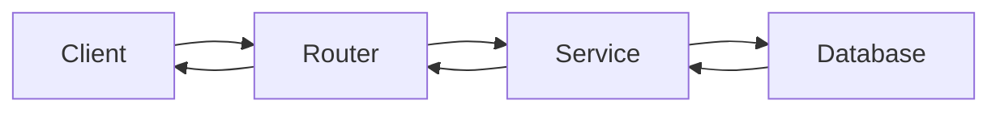

# Khidmati Iraq Backend - Student Assignment

## 1. Program Overview

Welcome to the Khidmati Iraq Backend project simulation. This program is designed as an individual software engineering simulation. You are stepping into the role of a junior backend developer who has just been assigned to an existing client project.

**Format:**
*   **Individual Work:** You have been provided with an independent Git repository containing the same backend starter template as other developers. You must work on your own copy of the project.
*   **Duration:** The program lasts two weeks.
*   **Meetings:** There will be four scheduled meetings throughout the two weeks to review progress, introduce new requirements, and present your final work.
*   **Final Presentation:** The fourth meeting is dedicated to individual project presentations and demonstrations of your completed solution.

**Why an existing codebase?**
In the real world, developers rarely build systems from zero. You are expected to understand an unfamiliar codebase, identify existing problems, implement new client requirements, write tests, and document your changes—all while ensuring you do not break existing functionality.

---

## 2. Student Role

You have joined the development project as a junior backend developer. The previous developer created the main backend structure and some working features. However, the client has requested improvements and reported several problems.

You are individually responsible for the final submitted solution. Your responsibilities include:
*   Understanding the current backend implementation.
*   Confirming that the starter application runs correctly.
*   Investigating the reported problems.
*   Implementing the requested features.
*   Protecting user data and enforcing role permissions.
*   Adding automated tests.
*   Documenting all your technical changes.
*   Demonstrating the completed backend to the client.

---

## 3. Client Request

**Message from the Client (Khidmati Iraq Administration):**

> *"Hello Team,*
> 
> *Thank you for the initial backend deployment. We have tested the system and identified several critical issues that need your urgent attention before we can launch:*
> 
> *   *First, our administrators are struggling to find specific reports. The reports are difficult to search and filter.*
> *   *We noticed a major security flaw: citizens must never be able to access another citizen’s report!*
> *   *Some employees have been able to access reports for incidents outside their assigned governorate.*
> *   *Report assignment to employees needs stronger validation; we are seeing invalid assignments.*
> *   *Some report-status changes are not being tracked correctly in the history log.*
> *   *Internal employee notes are currently visible to citizens; these must remain completely private.*
> *   *When a report is resolved, we need a proper resolution summary to be recorded.*
> *   *Our administrators need a simple dashboard to see a summary of the system's status.*
> *   *Finally, we need assurance that the API behavior is covered by automated tests to prevent future regressions.*
> 
> *Please resolve these issues as soon as possible.*
> 
> *Best regards,*
> *Khidmati Iraq Administration"*

---

## 4. Before Starting

Before making any changes to the code, complete this individual setup checklist:

* [ ] Clone or open your assigned repository.
* [ ] Read `README.md`.
* [ ] Inspect the complete folder structure.
* [ ] Create the PostgreSQL databases (`khidmati_iraq` and `khidmati_iraq_test`).
* [ ] Create and activate a virtual environment.
* [ ] Install project dependencies.
* [ ] Create `.env` from `.env.example`.
* [ ] Configure your own local database connection in `.env`.
* [ ] Run Alembic migrations.
* [ ] Run the seed script.
* [ ] Start the FastAPI server.
* [ ] Open Swagger documentation.
* [ ] Test the seeded accounts (Admin, Employee, Citizen).
* [ ] Run the existing automated tests.
* [ ] Confirm that the starter backend works before editing it.
* [ ] Create an initial Git commit if required.

**Useful Commands:**

```powershell
# Activate virtual environment (Windows)
.\.venv\Scripts\Activate.ps1

# Install dependencies
pip install -r requirements.txt

# Run migrations
alembic upgrade head

# Seed the database
python -m scripts.seed

# Start the development server
uvicorn app.main:app --reload

# Run automated tests
pytest -v
```

**Swagger UI** should be available at: `http://127.0.0.1:8000/docs`

*Note: You must use your own local PostgreSQL database and `.env` file.*

---

## 5. Initial Repository Checkpoint

Before changing any application code, create a checkpoint commit and document the starter state.

1.  Create a file at `docs/INITIAL_SETUP_REPORT.md` and record:
    *   Whether the application started successfully.
    *   Whether migrations completed.
    *   Whether seed data was created.
    *   Whether login worked for the seeded accounts.
    *   How many tests passed before you started development.
    *   Any starter-project errors or bugs you discovered during setup.

2.  Commit your setup state:
    ```powershell
    git add .
    git commit -m "Confirm starter project setup"
    git push
    ```

---

## 6. System Investigation Task

Before implementing features, you must investigate the backend architecture.

Create a file named `docs/SYSTEM_UNDERSTANDING.md`. In this document, identify and explain:
*   Where the FastAPI application starts.
*   Where the API routers are registered.
*   Where environment variables are loaded.
*   Where the database session is configured.
*   Where SQLAlchemy models are defined.
*   Where Pydantic schemas are defined.
*   Where JWT tokens are generated and validated.
*   Where current-user dependencies and role permissions are checked.
*   Where report business logic is implemented.
*   Where report statuses are defined.
*   Where seed data is created.
*   Where tests are located.

Your document must also clearly explain in simple English:
*   The folder structure and the purpose of the main folders (`app/api`, `app/core`, `app/models`, `app/schemas`, `app/services`).
*   The API request flow.
*   The main database entities and their relationships.
*   The three user roles and their general capabilities.
*   The report workflow (creation, updates, assignment).

**Diagram Requirement:**
Include one simple diagram using Mermaid (or a written flow) illustrating a standard request cycle in this architecture.

*Example Mermaid format:*

*(Adapt the diagram to reflect the actual project structure, e.g., how a citizen creates a report).*

---

## 7. Main Individual Development Tasks

Complete the following tasks in your repository.

### TASK-01 — Report Filtering, Search, and Pagination
*   **Client Need:** Administrators need to easily find specific reports.
*   **Current Problem:** The admin report-list endpoint lacks comprehensive filtering, searching, and pagination.
*   **Required Implementation:** Improve the admin report-list endpoint (`GET /api/v1/admin/reports`).
*   **Acceptance Criteria:**
    *   Filter by: `status`, `priority`, `category_id`, `governorate_id`, `assigned_employee_id`.
    *   Search keyword matching `reference_number`, `title`, or `description` (case-insensitive where supported).
    *   Pagination returning: `page`, `page_size`, `total`, `total_pages`, `items`.
    *   Every filter works independently and can be combined.
    *   Invalid page numbers or sizes are rejected.
    *   Empty results return an empty list.
    *   Citizens and employees cannot access the admin endpoint.
    *   Existing report-list behavior is not broken.
    *   Swagger documents all query parameters.
*   **Suggested Areas to Inspect:** `app/api/v1/admin.py`, `app/services/report_service.py`, `app/schemas/report.py`.
*   **Required Tests:** Filtering by one field, combining filters, matching a reference number, matching title/description, empty search results, pagination calculations, unauthorized access.
*   **Difficulty:** Medium
*   **Estimated Effort:** 2–3 hours
*   **Suggested Commit:** `git commit -m "Implement admin report filtering and pagination"`

### TASK-02 — Secure Citizen Report Ownership
*   **Client Need:** Citizens must never access another citizen’s report.
*   **Current Problem:** Authorization checks for report ownership might be missing or incomplete.
*   **Required Implementation:** Ensure citizens can only access their own reports across all citizen endpoints.
*   **Acceptance Criteria:**
    *   Citizens can access their own reports.
    *   Citizens cannot access another citizen’s report (viewing, updating, cancelling, viewing comments, adding comments, viewing history).
    *   Unauthorized access returns an appropriate HTTP response (e.g., 403 Forbidden or 404 Not Found).
    *   Ownership is checked using the authenticated user.
    *   Changing a report ID parameter cannot bypass authorization.
    *   Admins retain their authorized access.
    *   Employees retain only the access permitted by their role and governorate.
    *   Ownership logic is reused where practical.
*   **Suggested Areas to Inspect:** `app/api/v1/reports.py`, `app/services/report_service.py`.
*   **Required Tests:** Owner accesses report successfully, another citizen is rejected, unauthenticated access is rejected, owner can view their public comments, another citizen cannot view report history.
*   **Difficulty:** Medium
*   **Estimated Effort:** 1.5–2 hours
*   **Suggested Commit:** `git commit -m "Secure citizen report ownership"`

### TASK-03 — Validate Governorate and Area Relationships
*   **Client Need:** Reports must have valid location data.
*   **Current Problem:** The system might allow creating a report with an area that belongs to a different governorate.
*   **Required Implementation:** Validate that a report's area belongs to the selected governorate.
*   **Acceptance Criteria:**
    *   An area from another governorate is rejected.
    *   A nonexistent area is rejected.
    *   An inactive area is rejected.
    *   A nonexistent governorate is rejected.
    *   An inactive governorate is rejected.
    *   A valid area and governorate combination succeeds.
    *   The API returns a useful error message.
    *   Invalid location data is not saved.
*   **Suggested Areas to Inspect:** `app/services/report_service.py`, report creation and update flows.
*   **Required Tests:** Valid location, area from a different governorate, inactive area, inactive governorate, nonexistent area.
*   **Difficulty:** Easy to Medium
*   **Estimated Effort:** 1–1.5 hours
*   **Suggested Commit:** `git commit -m "Validate report governorate and area"`

### TASK-04 — Complete Report Assignment
*   **Client Need:** Admins must be able to securely assign reports to valid employees.
*   **Current Problem:** Report assignment validation is incomplete.
*   **Required Implementation:** Enforce rules when an admin assigns a report.
*   **Acceptance Criteria:**
    *   Only an admin can assign a report.
    *   The selected user must exist, have the `employee` role, and be active.
    *   The employee must belong to the report’s governorate.
    *   The employee ID must be stored.
    *   The report status must become `assigned`.
    *   A status-history record must be created.
    *   The assignment and history update must succeed or fail together (transactional).
    *   Failed assignment does not partially update the report.
*   **Suggested Areas to Inspect:** `app/api/v1/admin.py`, `app/services/report_service.py`.
*   **Required Tests:** Cover all valid and invalid cases (cross-governorate, assigning citizen/admin, inactive employee, nonexistent user/report, history creation).
*   **Difficulty:** Medium
*   **Estimated Effort:** 2 hours
*   **Suggested Commit:** `git commit -m "Complete report assignment validation"`

### TASK-05 — Report Status Workflow
*   **Client Need:** Report status changes must follow strict rules and be tracked.
*   **Current Problem:** Centralized validation for all allowed status transitions is needed.
*   **Required Implementation:** Implement strict transition rules and history tracking.
*   **Allowed transitions:**
    *   `submitted -> under_review`
    *   `submitted -> rejected`
    *   `submitted -> cancelled`
    *   `under_review -> assigned`
    *   `under_review -> rejected`
    *   `assigned -> in_progress`
    *   `assigned -> under_review`
    *   `in_progress -> resolved`
    *   `in_progress -> assigned`
*   **Acceptance Criteria:**
    *   Citizens may only cancel their own `submitted` or `under_review` report.
    *   Employees may update only reports within their governorate according to allowed transitions.
    *   Admins may perform authorized administrative transitions.
    *   Unlisted or unauthorized transitions fail.
    *   Every successful status change creates a history record (with previous status, new status, user, timestamp).
    *   No report is updated without a matching history entry (transactional).
    *   Transition rules are defined in one reusable place.
*   **Suggested Areas to Inspect:** `app/services/report_service.py`.
*   **Required Tests:** Every valid transition, representative invalid transitions, citizen cancellation, unauthorized employee transition, history creation, transaction consistency.
*   **Difficulty:** Medium to Hard
*   **Estimated Effort:** 3 hours
*   **Suggested Commit:** `git commit -m "Implement report status workflow"`

### TASK-06 — Protect Internal Notes
*   **Client Need:** Internal employee notes must remain completely private from citizens.
*   **Current Problem:** Internal notes might be visible in comment lists or report details.
*   **Required Implementation:** Secure internal notes at the backend level.
*   **Acceptance Criteria:**
    *   Citizens cannot create internal notes.
    *   Citizens cannot view internal notes (excluded from responses).
    *   Citizens cannot use request parameters to bypass and retrieve internal notes.
    *   Employees can create and view internal notes only for authorized reports within their governorate.
    *   Admins can view internal notes.
    *   Public comments remain visible to the citizen.
*   **Suggested Areas to Inspect:** `app/api/v1/reports.py`, `app/api/v1/employee.py`, `app/services/report_service.py`.
*   **Required Tests:** Citizen visibility, employee visibility, unauthorized employee access, admin visibility, citizen creation attempt, public-comment visibility.
*   **Difficulty:** Medium
*   **Estimated Effort:** 1.5–2 hours
*   **Suggested Commit:** `git commit -m "Protect internal report notes"`

### TASK-07 — Complete Report Resolution
*   **Client Need:** Resolved reports must have a recorded summary of the fix.
*   **Current Problem:** Resolution workflow lacks mandatory summary validation.
*   **Required Implementation:** Enforce resolution rules.
*   **Acceptance Criteria:**
    *   Only authorized employees or admins may resolve a report.
    *   The report must be in a valid status to be resolved.
    *   A resolution summary is required (whitespace-only summaries are rejected).
    *   The summary and a UTC-aware `resolved_at` timestamp are stored.
    *   The status becomes `resolved`.
    *   A status-history entry is created.
    *   The operation is transactional.
    *   The citizen can view the public resolution summary.
*   **Suggested Areas to Inspect:** `app/api/v1/employee.py`, `app/services/report_service.py`.
*   **Required Tests:** Resolving without summary fails, blank summary fails, invalid status fails, unauthorized employee fails, valid resolution succeeds, date is stored, history records the transition.
*   **Difficulty:** Medium
*   **Estimated Effort:** 1.5–2 hours
*   **Suggested Commit:** `git commit -m "Complete report resolution workflow"`

### TASK-08 — Admin Dashboard Summary
*   **Client Need:** Administrators need an overview of system metrics.
*   **Current Problem:** The admin dashboard endpoint (`GET /api/v1/admin/dashboard`) is incomplete.
*   **Required Implementation:** Return accurate summary statistics.
*   **Acceptance Criteria:**
    *   Return: total reports, open reports, resolved reports, reports by status, reports by priority, reports by category.
    *   "Open reports" are those NOT `resolved`, `rejected`, or `cancelled`.
    *   Counts match the database.
    *   Only admins can access the endpoint.
    *   Category counts include a clear category name or ID.
    *   Empty database results are handled gracefully.
    *   Queries are reasonably efficient.
*   **Suggested Areas to Inspect:** `app/api/v1/admin.py`, `app/services/report_service.py`.
*   **Required Tests:** Total reports, open reports, resolved reports, grouping by status/priority/category, unauthorized access, empty database behavior.
*   **Difficulty:** Medium
*   **Estimated Effort:** 2 hours
*   **Suggested Commit:** `git commit -m "Complete admin dashboard summary"`

### TASK-09 — Automated Testing
*   **Client Need:** The API must be robust against future regressions.
*   **Current Problem:** Test coverage is incomplete for the new features.
*   **Required Implementation:** Write tests for all implemented tasks.
*   **Acceptance Criteria:**
    *   A separate PostgreSQL test database is used.
    *   Tests do not depend on execution order and clean up their data.
    *   Successful cases, failure cases, and authorization cases are tested.
    *   Existing tests still pass.
    *   Test names clearly explain expected behavior.
*   **Required Command:** `pytest -v`
*   **Suggested Areas to Inspect:** `tests/` directory.
*   **Difficulty:** Medium
*   **Estimated Effort:** 2–3 hours
*   **Suggested Commit:** `git commit -m "Add tests for project requirements"`

### TASK-10 — Documentation and Final Cleanup
*   **Client Need:** The codebase must be maintainable and well-documented.
*   **Required Implementation:** Update `README.md` and create specific docs.
*   **Acceptance Criteria:**
    *   **`docs/API_CHANGES.md`**: Document endpoints modified/added, filters added, authorization rules, validation rules, status workflow rules, and error response examples.
    *   **`docs/TESTING_REPORT.md`**: Record tests executed, passing/failing counts, problems discovered/fixed, manual tests performed, and final test command.
    *   **`docs/KNOWN_LIMITATIONS.md`**: Document unfinished requirements, known bugs, technical limitations, assumptions, and future improvements.
    *   No secrets are committed (except fictional seed credentials).
*   **Difficulty:** Easy to Medium
*   **Estimated Effort:** 1.5 hours
*   **Suggested Commit:** `git commit -m "Update project documentation"`

---

## 8. CHANGE REQUEST — Urgent Reports

*(Note: This requirement simulates a changing client request during development.)*

**Client Need:** The client now wants urgent reports to be easier to identify.

**Required Implementation:**
*   Add an optional `urgent_only` filter (boolean) for the admin report list.
*   Add an optional `urgent_only` filter for the employee report list.
*   Add validation preventing citizens from setting `urgent` priority when creating or updating reports.
*   Add an `urgent_reports` count to the admin dashboard.

**Acceptance Criteria:**
*   `urgent_only=true` returns only urgent reports.
*   Omitting `urgent_only` or passing `false` preserves normal behavior.
*   Citizens cannot set priority to urgent.
*   Employees and admins follow the existing priority permissions.
*   The dashboard returns `urgent_reports`.
*   Existing API clients remain compatible.
*   Tests cover the new requirement.
*   Documentation is updated.

**Required Commit:**
```powershell
git commit -m "Implement urgent reports change request"
```

---

## 9. Individual Work Plan

Here is the recommended order for tackling the tasks. You may adjust the order when dependencies require it, but do not rewrite the entire project from scratch.

| Order | Work                                 |
| ----- | ------------------------------------ |
| 1     | Set up and run the starter project   |
| 2     | Understand the existing architecture |
| 3     | Secure report ownership (TASK-02)    |
| 4     | Validate governorates and areas (TASK-03)|
| 5     | Implement report filtering (TASK-01) |
| 6     | Complete report assignment (TASK-04) |
| 7     | Implement status workflow (TASK-05)  |
| 8     | Protect internal notes (TASK-06)     |
| 9     | Complete resolution (TASK-07)        |
| 10    | Complete dashboard (TASK-08)         |
| 11    | Add tests (TASK-09)                  |
| 12    | Implement change request (Section 8) |
| 13    | Complete documentation (TASK-10)     |
| 14    | Prepare final presentation           |

---

## 10. Two-Week Calendar

### Meeting 1 — Individual Project Handover
**Topics:** Client scenario, project requirements, backend demonstration, repository access, environment setup, PostgreSQL setup, Swagger exploration, architecture investigation, basic Git workflow, individual work planning.
**Required Outputs after Meeting 1:** Running backend, completed setup checklist, initial repository checkpoint, `docs/INITIAL_SETUP_REPORT.md`, `docs/SYSTEM_UNDERSTANDING.md`, personal task plan.

### Days Between Meetings 1 and 2
**Focus:** Report ownership, governorate/area validation, filtering and pagination, initial tests.
**Recommended Checkpoint:** TASK-01, TASK-02, TASK-03 completed; relevant tests added; at least three meaningful Git commits.

### Meeting 2 — Individual Technical Review
**Be ready to show:** Running project, architecture understanding, completed tasks, Git history, tests, current blockers.
**Topics:** Database relationships, authorization, service-layer logic, assignment validation, status transitions, database transactions, testing guidance.
**Required Outputs after Meeting 2:** Working ownership validation, working location validation, working filtering, assignment implementation, initial status-workflow implementation, updated tests.

### Days Between Meetings 2 and 3
**Focus:** Report assignment, status transitions, status history, internal-note protection, resolution workflow, admin dashboard.
**Recommended Checkpoint:** TASK-04, TASK-05, TASK-06 completed; TASK-07 nearing completion; TASK-08 started; automated tests expanded.

### Meeting 3 — Client Change and Final Development
**Topics:** Demonstrate current progress, announce urgent-reports change request, review remaining backend problems, test API behavior, review documentation requirements, explain presentation expectations.
**Required Outputs after Meeting 3:** All main development tasks completed, urgent-report change completed, tests passing, documentation draft completed, final demonstration prepared.

### Days Before Meeting 4
**Focus:** Run all tests, manually test via Swagger, review authorization, clean unused code, check migrations, verify seed data, update documentation, push final commits, prepare presentation and backup screenshots.

### Meeting 4 — Individual Final Presentation
**Format:** You will present your repository and implementation (approx. 16 minutes).
*   2 minutes: project and architecture understanding
*   4 minutes: completed requirements
*   4 minutes: live API demonstration
*   2 minutes: automated tests
*   2 minutes: client change request
*   2 minutes: technical challenge and lesson learned
*   2 minutes: questions

---

## 11. Required Individual Deliverables

Ensure you submit all the following:

* [ ] Your own backend repository (pushed).
* [ ] Complete source code.
* [ ] Database models & Alembic migrations.
* [ ] Updated seed script (if changed).
* [ ] Passing automated tests.
* [ ] Updated `README.md`.
* [ ] `docs/INITIAL_SETUP_REPORT.md`.
* [ ] `docs/SYSTEM_UNDERSTANDING.md`.
* [ ] `docs/API_CHANGES.md`.
* [ ] `docs/TESTING_REPORT.md`.
* [ ] `docs/KNOWN_LIMITATIONS.md`.
* [ ] Swagger/OpenAPI JSON export (if requested).
* [ ] Final Git commit history.
* [ ] Final presentation materials.
* [ ] `docs/INDIVIDUAL_REFLECTION.md`.
* [ ] `docs/AI_USAGE.md`.

**Individual Reflection (`docs/INDIVIDUAL_REFLECTION.md`) must answer:**
1. What part of the existing codebase was hardest to understand?
2. What was the most important bug or problem you fixed?
3. Which business rule required the most thinking?
4. Which test gave you the most confidence?
5. How did you respond to the urgent-reports change request?
6. What would you improve with one more week?
7. How did AI tools help you?
8. Which submitted code can you explain without AI assistance?

---

## 12. Definition of Done

A task is considered complete only when:
*   The feature works and the business requirement is satisfied.
*   Authorization is enforced and validation is implemented.
*   Errors return suitable HTTP status codes.
*   Database changes have migrations where needed.
*   Tests are added and existing tests still pass.
*   Swagger displays the updated behavior.
*   Documentation is updated.
*   You have created a meaningful Git commit.
*   **You can explain the implementation.** (Copying generated code without understanding it does not satisfy the Definition of Done).

---

## 13. Individual Evaluation Rubric

Total: 100 points

| Evaluation Area                         |  Points |
| --------------------------------------- | ------: |
| System understanding                    |      10 |
| Core feature implementation             |      25 |
| Business rules and validation           |      15 |
| Authorization and data security         |      15 |
| Database and status-history correctness |      10 |
| Automated testing                       |      10 |
| Code quality and Git history            |       5 |
| Documentation                           |       5 |
| Final individual presentation           |       5 |
| **Total**                               | **100** |

**Levels for each category:**
*   **Excellent:** Fully implemented, highly robust, well-tested, clearly explained.
*   **Acceptable:** Meets basic requirements but may lack polish or edge-case handling.
*   **Incomplete:** Missing significant logic, fails tests, or unable to explain the code.

*Note: Marks will be deducted if you cannot explain your code, if most work is dumped in one final commit, if code is copied from another student, if secrets are committed, or if documentation does not match reality.*

---

## 14. Individual Submission Rules

*   Every student must submit their own repository.
*   Repositories must not be shared as one combined solution.
*   You may discuss concepts, but you must write and understand your own implementation. Do not copy code from another student.
*   Do not delete working features to hide errors.
*   Do not change API behavior without documenting it.
*   Do not commit `.env` or real passwords/secrets.
*   Do not use SQLite instead of PostgreSQL.
*   Do not replace the starter template with a newly generated application.
*   Do not remove tests because they fail. Incomplete work must be documented honestly.
*   The instructor may ask you to explain or modify any part of the code during the presentation.
*   Every required change should have a meaningful Git commit.
*   The final repository must be pushed before the submission deadline.

---

## 15. AI Usage Record

Create a file at `docs/AI_USAGE.md` detailing:
*   AI tools used (e.g., ChatGPT, Claude, Gemini).
*   Tasks where AI was used.
*   Example prompts used.
*   Code or suggestions accepted.
*   Code or suggestions rejected.
*   Errors produced by AI.
*   How you verified generated code.
*   What you learned from using AI.

*The purpose is not to prevent AI use, but to evaluate whether you used it responsibly and understand the resulting code.*

---

## 16. Final Student Checklist

### Environment
* [ ] My virtual environment works.
* [ ] My PostgreSQL database connects.
* [ ] My `.env` is not committed.
* [ ] Alembic migrations run.
* [ ] The seed script runs safely.
* [ ] The FastAPI server starts.
* [ ] Swagger opens.

### Authentication and Permissions
* [ ] Registration works.
* [ ] Login works.
* [ ] Inactive users cannot log in.
* [ ] Citizen permissions work.
* [ ] Employee permissions work.
* [ ] Admin permissions work.
* [ ] Citizens can access only their reports.
* [ ] Employees cannot access another governorate’s reports.
* [ ] Internal notes are protected.

### Reports
* [ ] Report creation works.
* [ ] Governorate and area validation works.
* [ ] Report filtering works.
* [ ] Search works.
* [ ] Pagination works.
* [ ] Assignment validation works.
* [ ] Valid status transitions work.
* [ ] Invalid transitions fail.
* [ ] Every status change creates history.
* [ ] Resolution requires a summary.
* [ ] `resolved_at` is stored.
* [ ] Dashboard counts are correct.
* [ ] Urgent-report requirements work.

### Quality
* [ ] Automated tests pass.
* [ ] Tests use a separate test database.
* [ ] Swagger matches my implementation.
* [ ] Documentation is complete.
* [ ] Known limitations are documented.
* [ ] My Git commits are clear.
* [ ] My repository is pushed.
* [ ] My presentation is ready.
* [ ] I can explain my submitted code.
